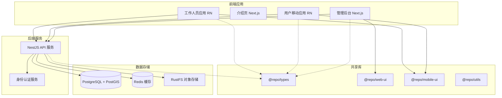

# 家庭服务平台 (Home Server)

[](https://www.typescriptlang.org/)
[](https://nestjs.com/)
[](https://nextjs.org/)
[](https://expo.dev/)
[](https://turbo.build/)

基于现代化全栈技术栈构建的家庭服务平台，采用 Turborepo Monorepo 架构，包含后端 API 服务、管理后台、介绍页项目、用户移动应用和工作人员移动应用。

## 📋 目录

- [项目概述](#-项目概述)
- [技术架构](#️-技术架构)
- [项目结构](#-项目结构)
- [环境要求](#-环境要求)
- [快速开始](#-快速开始)
- [开发指南](#-开发指南)
- [部署指南](#-部署指南)
- [API 文档](#-api-文档)
- [贡献指南](#-贡献指南)

## 🎯 项目概述

家庭服务平台是一个综合性的服务预约和管理系统，为用户提供便捷的家庭服务预约体验，为工作人员提供高效的工作管理工具，为管理员提供完善的运营管理后台。

### 核心功能

- 🏠 **家庭服务预约**：用户可以浏览服务分类、预约服务、管理订单
- 👥 **工作人员管理**：工作人员接单、服务执行、收益管理
- 🎛️ **管理后台**：服务管理、用户管理、订单管理、数据统计
- 🌐 **介绍页项目**：提供产品介绍、下载引导、FAQ、博客和法律文档
- 📱 **移动端支持**：iOS/Android 原生体验
- 🔐 **统一认证**：基于 better-auth 的多端身份认证
- 🗺️ **地理位置**：基于腾讯地图的位置服务

### 目标用户

- **普通用户**：需要家庭服务的个人和家庭
- **服务人员**：提供家庭服务的专业工作者
- **平台管理员**：负责平台运营和管理的工作人员

## 🏗️ 技术架构

### 整体架构



### 技术选型

#### 后端技术栈

- **框架**：NestJS + TypeScript
- **数据库**：PostgreSQL + PostGIS (地理空间支持)
- **搜索引擎**：PGroonga (全文搜索)
- **缓存**：Redis + ioredis
- **ORM**：Drizzle ORM
- **认证**：better-auth
- **API 文档**：Swagger + Scalar
- **分布式锁**：基于 Redis 的可重入分布式锁

#### 前端技术栈

- **管理后台**：Next.js + App Router + Tailwind CSS
- **介绍页项目**：Next.js + App Router + Tailwind CSS，博客和法律文档由 `content/` 生成
- **移动应用**：React Native + Expo
- **状态管理**：React Context + Zustand
- **UI 组件**：shadcn/ui + NativeWind
- **地图服务**：腾讯地图 SDK

#### 开发工具链

- **构建工具**：Turborepo
- **包管理**：pnpm
- **代码规范**：ESLint + Prettier
- **类型检查**：TypeScript
- **容器化**：Docker + Docker Compose

## 📁 项目结构

```text
.
├── apps/                           # 应用程序目录
│   ├── backend/                    # NestJS 后端 API 服务
│   │   ├── src/
│   │   │   ├── modules/           # 业务模块
│   │   │   ├── common/           # 通用组件
│   │   │   ├── lib/              # 核心库
│   │   │   └── main.ts           # 应用入口
│   │   ├── drizzle/              # 数据库迁移文件
│   │   └── auth.ts               # 认证配置
│   ├── admin-web/                # Next.js 管理后台
│   │   └── src/
│   │       ├── app/              # App Router 页面
│   │       ├── components/       # React 组件
│   │       └── lib/              # 工具库
│   ├── marketing-web/            # Next.js 介绍页项目
│   │   ├── src/                  # App Router 页面与站点组件
│   │   ├── content/              # 博客与法律文档内容
│   │   └── scripts/              # 内容生成脚本
│   ├── mobile-user/              # 用户移动应用 (React Native)
│   │   ├── app/                  # Expo Router 页面
│   │   ├── components/           # RN 组件
│   │   └── hooks/                # 自定义 Hooks
│   └── mobile-worker/            # 工作人员移动应用
├── packages/                      # 共享包目录
│   ├── types/                    # TypeScript 类型定义
│   ├── web-ui/                   # Web UI 组件库
│   ├── mobile-ui/                # Mobile UI 组件库
│   ├── utils/                    # 工具函数库
│   ├── eslint-config/            # ESLint 配置
│   └── typescript-config/        # TypeScript 配置
├── docker-images/                # Docker 镜像定义
├── env/                         # 环境配置
└── docker-compose.yaml          # 容器编排配置
```

### 应用和包说明

#### 核心应用

- **`backend`**：基于 NestJS 的后端 API 服务，提供 RESTful API
- **`admin-web`**：基于 Next.js 的管理后台，支持 SSR/SSG
- **`marketing-web`**：基于 Next.js 的介绍页项目，提供产品介绍、下载入口、FAQ、博客和法律文档
- **`mobile-user`**：基于 React Native Expo 的用户端移动应用
- **`mobile-worker`**：基于 React Native Expo 的工作人员端移动应用

#### 共享包

- **`@repo/types`**：全项目共享的 TypeScript 类型定义
- **`@repo/web-ui`**：基于 shadcn/ui 的 Web 端组件库
- **`@repo/mobile-ui`**：基于 NativeWind 的移动端组件库
- **`@repo/utils`**：跨平台工具函数库
- **`@repo/eslint-config`**：统一的 ESLint 代码规范配置
- **`@repo/typescript-config`**：统一的 TypeScript 编译配置

## 🔧 环境要求

### 必需环境

- **Node.js**: >=18.0.0
- **pnpm**: >=9.0.0
- **Docker**: >=20.0.0 (用于数据库和缓存服务)
- **Docker Compose**: >=2.0.0

### 可选工具

- **Turbo CLI**: 全局安装可提升构建性能
- **Expo CLI**: 用于移动应用开发和预览

## 🚀 快速开始

> 请先运行 `pnpm env:setup`，它会把 `env/` 片段合并生成各 app 的 `.env.development/.env.production`。未执行前，后端、管理端、介绍页和移动端可能读取不到必要环境变量。

### 1. 克隆项目

```bash
git clone <repository-url>
cd home_server
```

### 2. 安装依赖

```bash
pnpm install
```

### 3. 启动基础服务

```bash
# 启动 PostgreSQL、Redis 和对象存储服务
docker-compose up -d
```

### 4. 配置环境变量

```bash
# 生成各应用的 .env.development/.env.production
pnpm env:setup
```

### 5. 数据库初始化

```bash
# 运行数据库迁移
cd apps/backend
pnpm db:migrate
```

### 6. 启动开发服务

```bash
# 启动所有服务
pnpm dev

# 或者启动特定服务
pnpm backend:dev      # 后端 API (http://localhost:5050)
pnpm admin:dev        # 管理后台 (http://localhost:3000)
pnpm marketing:dev    # 介绍页项目
pnpm mobile-user:dev  # 用户移动应用
pnpm mobile-worker:dev # 工作人员移动应用
```

## 💻 开发指南

### 构建项目

```bash
# 构建所有应用和包
turbo build

# 构建特定应用
turbo build --filter=backend
turbo build --filter=admin-web
```

### 运行测试

```bash
# 运行所有测试
turbo test

# 运行特定应用的测试
turbo test --filter=backend
```

### 代码规范检查

```bash
# 运行 ESLint 检查
turbo lint

# 自动修复代码格式
turbo lint:fix
```

### 类型检查

```bash
# 运行 TypeScript 类型检查
turbo type-check
```

## 🚀 部署指南

### 生产环境部署

#### 1. 容器化部署（推荐）

```bash
# 构建生产镜像
docker-compose -f docker-compose.prod.yaml build

# 启动生产环境
docker-compose -f docker-compose.prod.yaml up -d
```

#### 2. 传统部署

```bash
# 构建生产版本
turbo build

# 启动后端服务
cd apps/backend && pnpm start:prod

# 启动前端服务
cd apps/admin-web && pnpm start
```

### 环境配置

生产环境需要配置以下服务：

- **数据库**: PostgreSQL + PostGIS + PGroonga
- **缓存**: Redis
- **对象存储**: RustFS 或兼容 S3 的存储服务
- **反向代理**: Nginx (可选)

## 📚 API 文档

启动后端服务后，可以访问以下地址查看 API 文档：

- **Swagger UI**: <http://localhost:5050/api/docs>
- **Scalar UI**: <http://localhost:5050/api/scalar>

## 🔍 核心功能模块

### 用户认证与授权

- 多端统一认证（Web + 移动端）
- 微信登录集成
- 实名认证功能
- 基于角色的权限控制

### 服务管理

- 服务分类层级管理
- 服务项目CRUD
- 全文搜索支持
- 地理位置服务

### 订单管理

- 订单状态机设计
- 支付集成
- 评价系统
- 财务对账

### 数据分析

- 业务数据统计
- 收益分析
- 用户行为分析

## 🤝 贡献指南

### 开发流程

1. Fork 项目到您的 GitHub 账号
2. 创建功能分支：`git checkout -b feature/amazing-feature`
3. 提交更改：`git commit -m 'Add some amazing feature'`
4. 推送到分支：`git push origin feature/amazing-feature`
5. 提交 Pull Request

### 代码规范

- 遵循 ESLint 和 Prettier 配置
- 使用 TypeScript 严格模式
- 编写单元测试覆盖核心功能
- 遵循 Git 提交信息规范

### 问题反馈

如果您发现 bug 或有功能建议，请通过 GitHub Issues 提交。

## 🔗 相关链接

- [Turborepo 文档](https://turbo.build/repo/docs)
- [NestJS 文档](https://docs.nestjs.com/)
- [Next.js 文档](https://nextjs.org/docs)
- [React Native 文档](https://reactnative.dev/docs/getting-started)
- [Expo 文档](https://docs.expo.dev/)
